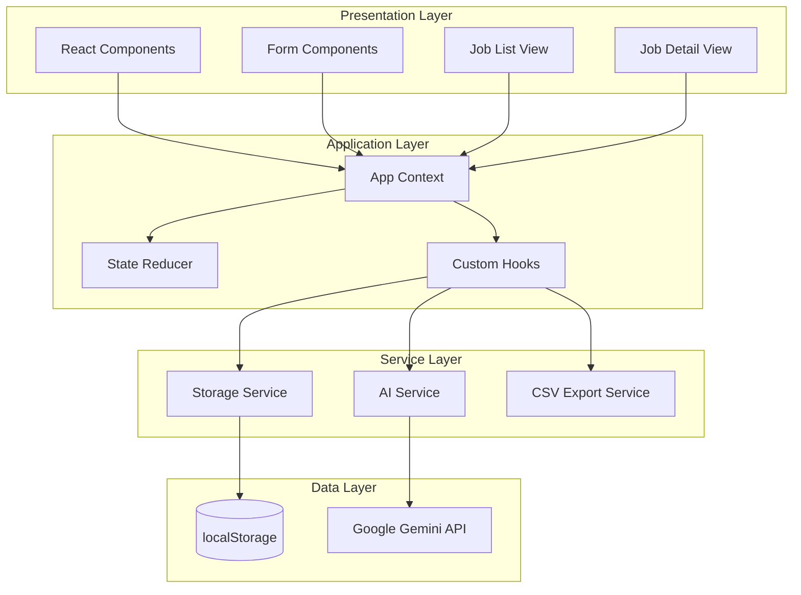
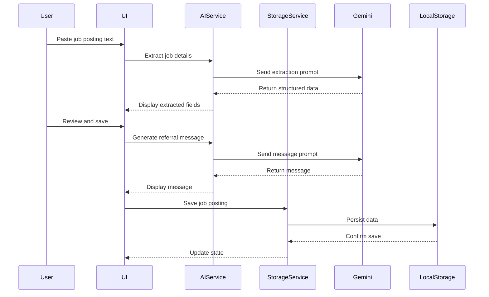

# Design Document

## Overview

The LinkedIn Job Application Tracker is a single-page web application built with React and TypeScript that enables job seekers to efficiently track their job applications. The application leverages Google Gemini AI to extract structured data from raw LinkedIn job posting text and generate professional referral messages. All data persists in the browser using the window.storage API (localStorage with fallback handling).

### Key Features
- AI-powered job detail extraction from pasted text
- Automatic referral message generation
- Application status tracking with timestamps
- Referral contact management with status tracking
- Search and filter capabilities
- CSV export functionality
- Keyboard shortcuts for power users
- Responsive design for mobile and desktop

### Technology Stack
- **Frontend**: React 18+ with TypeScript
- **Styling**: Tailwind CSS for modern, responsive UI
- **State Management**: React Context + useReducer for global state
- **Storage**: window.localStorage with error handling
- **AI Integration**: Google Gemini API for extraction and message generation
- **Build Tool**: Vite for fast development and builds
- **Testing**: Vitest for unit tests, fast-check for property-based testing
- **Validation**: Zod for runtime schema validation of AI responses
- **Configuration**: .env.local for storing the Gemini API Key (VITE_GEMINI_API_KEY)

## Architecture



### Data Flow



## Components and Interfaces

### React Components

```typescript
// Component hierarchy
App
├── Header
│   ├── SearchBar
│   └── FilterDropdown
├── JobList
│   └── JobCard (multiple)
├── JobDetail
│   ├── JobInfo
│   ├── StatusSelector
│   ├── ReferralMessage
│   ├── ReferralContacts
│   │   └── ContactCard (multiple)
│   └── NotesSection
├── AddJobModal
│   ├── TextInput (paste area)
│   ├── ExtractedFields
│   └── ActionButtons
└── ExportButton
```

### Service Interfaces

```typescript
// AI Service Interface
interface AIService {
  extractJobDetails(rawText: string): Promise<ExtractedJobData>;
  generateReferralMessage(jobTitle: string, company: string): Promise<string>;
}

interface ExtractedJobData {
  jobTitle: string | null;
  company: string | null;
  location: string | null;
  description: string | null;
  confidence: {
    jobTitle: number;
    company: number;
    location: number;
    description: number;
  };
}

// Zod schema for validating AI responses
const ExtractedJobDataSchema = z.object({
  jobTitle: z.string().nullable(),
  company: z.string().nullable(),
  location: z.string().nullable(),
  description: z.string().nullable(),
});

// Storage Service Interface
interface StorageService {
  saveJob(job: JobPosting): Promise<void>;
  getJob(id: string): Promise<JobPosting | null>;
  getAllJobs(): Promise<JobPosting[]>;
  updateJob(id: string, updates: Partial<JobPosting>): Promise<void>;
  deleteJob(id: string): Promise<void>;
  isAvailable(): boolean;
}

// Export Service Interface
interface ExportService {
  generateCSV(jobs: JobPosting[]): string;
  downloadCSV(jobs: JobPosting[]): void;
}
```

## Data Models

```typescript
// Application Status enum
type ApplicationStatus = 'Saved' | 'Applied' | 'Interview' | 'Offer' | 'Rejected';

// Referral Status enum
type ReferralStatus = 'Not Contacted' | 'Contacted' | 'Referral Received' | 'No Response';

// Referral Contact model
interface ReferralContact {
  id: string;
  name: string;
  contactMethod: string;  // email, LinkedIn, phone, etc.
  dateContacted: string | null;  // ISO date string
  status: ReferralStatus;
}

// Job Posting model
interface JobPosting {
  id: string;
  jobTitle: string;
  company: string;
  location: string;
  description: string;
  linkedInUrl: string | null;
  referralMessage: string;
  notes: string;
  status: ApplicationStatus;
  referralContacts: ReferralContact[];
  dateAdded: string;      // ISO date string
  dateApplied: string | null;  // ISO date string
  lastUpdated: string;    // ISO date string
}

// App State model
interface AppState {
  jobs: JobPosting[];
  searchQuery: string;
  statusFilter: ApplicationStatus | 'All';
  selectedJobId: string | null;
  isAddModalOpen: boolean;
  isLoading: boolean;
  error: string | null;
}
```

### State Actions

```typescript
type AppAction =
  | { type: 'SET_JOBS'; payload: JobPosting[] }
  | { type: 'ADD_JOB'; payload: JobPosting }
  | { type: 'UPDATE_JOB'; payload: { id: string; updates: Partial<JobPosting> } }
  | { type: 'DELETE_JOB'; payload: string }
  | { type: 'SET_SEARCH'; payload: string }
  | { type: 'SET_FILTER'; payload: ApplicationStatus | 'All' }
  | { type: 'SELECT_JOB'; payload: string | null }
  | { type: 'TOGGLE_ADD_MODAL'; payload: boolean }
  | { type: 'SET_LOADING'; payload: boolean }
  | { type: 'SET_ERROR'; payload: string | null };
```


## Correctness Properties

*A property is a characteristic or behavior that should hold true across all valid executions of a system-essentially, a formal statement about what the system should do. Properties serve as the bridge between human-readable specifications and machine-verifiable correctness guarantees.*

### Property 1: Storage Round Trip
*For any* valid JobPosting object, saving it to storage and then retrieving it by ID should return an equivalent object with all fields preserved (job title, company, location, description, URL, referral message, notes, status, contacts, and timestamps).
**Validates: Requirements 3.1, 3.2, 3.4, 5.2, 5.4, 8.2**

### Property 2: Unique Job Identifiers
*For any* two JobPosting objects saved to storage, their assigned IDs should be different.
**Validates: Requirements 3.3**

### Property 3: Status Update Persistence with Timestamp
*For any* saved JobPosting and any valid ApplicationStatus, updating the status should persist the new status and update the lastUpdated timestamp to a value greater than or equal to the previous timestamp.
**Validates: Requirements 4.2, 4.3**

### Property 4: Date Applied Auto-Set
*For any* JobPosting where the status is changed to "Applied", the dateApplied field should be automatically set to a non-null ISO date string.
**Validates: Requirements 4.4**

### Property 5: New Contact Default Status
*For any* ReferralContact added to a JobPosting, the initial status should be "Not Contacted".
**Validates: Requirements 5.3**

### Property 6: Multiple Contacts Preservation
*For any* JobPosting with N ReferralContacts added, retrieving the job should return exactly N contacts with all their fields preserved.
**Validates: Requirements 5.1**

### Property 7: Job List Sorting
*For any* list of JobPostings returned by getAllJobs, the list should be sorted by dateAdded in descending order (newest first).
**Validates: Requirements 6.4**

### Property 8: CSV Completeness
*For any* set of N JobPostings with their associated ReferralContacts, the generated CSV should contain exactly N data rows (plus header), and each row should include all contact information for that job.
**Validates: Requirements 7.1, 7.4**

### Property 9: CSV Column Order
*For any* generated CSV, the header row should contain columns in this exact order: Job Title, Company, Location, Status, LinkedIn URL, Contact Person, Contact Info, AI Referral Message, Personal Notes, Date Added, Date Applied, Last Updated.
**Validates: Requirements 7.2**

### Property 10: CSV Special Character Escaping
*For any* JobPosting containing special characters (commas, quotes, newlines) in any text field, the generated CSV should properly escape these characters such that parsing the CSV produces the original values.
**Validates: Requirements 7.5**

### Property 11: CSV Filename Format
*For any* date, the generated CSV filename should match the pattern "job-applications-YYYY-MM-DD.csv" where YYYY-MM-DD is the current date.
**Validates: Requirements 7.6**

### Property 12: Deletion Removes Job
*For any* saved JobPosting, after deletion, attempting to retrieve it by ID should return null, and it should not appear in getAllJobs results.
**Validates: Requirements 9.2**

### Property 13: Search Filter Correctness
*For any* search query string and set of JobPostings, the filtered results should only contain jobs where the job title OR company name contains the search query (case-insensitive).
**Validates: Requirements 10.1**

### Property 14: Status Filter Correctness
*For any* ApplicationStatus filter and set of JobPostings, the filtered results should only contain jobs with that exact status.
**Validates: Requirements 10.2**

### Property 15: Clear Filter Returns All
*For any* set of saved JobPostings, when no filters are applied (search empty, status filter "All"), getAllJobs should return all saved jobs.
**Validates: Requirements 6.1, 10.4**

### Property 16: Extraction Returns Structured Data
*For any* non-empty job posting text, the AI extraction should return an object with jobTitle, company, location, and description fields (each may be null but the structure must be present).
**Validates: Requirements 1.1, 1.4**

### Property 17: Referral Message Contains Job Details
*For any* JobPosting with non-empty jobTitle and company, the generated referral message should contain both the job title and company name.
**Validates: Requirements 2.1**

## Error Handling

### Storage Errors
- **Storage Unavailable**: When localStorage is not available (private browsing, quota exceeded), display a warning banner and operate in memory-only mode
- **Parse Errors**: When stored data is corrupted, attempt recovery by clearing invalid entries and notifying the user
- **Quota Exceeded**: When storage quota is reached, notify user and suggest exporting data before clearing old entries

### AI Service Errors
- **Network Errors**: Display retry option with exponential backoff, allow manual entry as fallback
- **Rate Limiting**: Queue requests and display progress indicator
- **Invalid Response**: Fall back to empty fields with error message, allow manual entry
- **Timeout**: Cancel request after 10 seconds, display timeout message with retry option

### Input Validation Errors
- **Empty Job Title**: Require job title before saving, highlight field with error message
- **Invalid URL**: Validate LinkedIn URL format, show warning but allow saving
- **Empty Contact Name**: Require name when adding referral contact

### Export Errors
- **Download Blocked**: Provide alternative copy-to-clipboard option for CSV content
- **Large Dataset**: Warn user if export may take time for large datasets (>1000 jobs)

## Testing Strategy

### Unit Testing Framework
- **Framework**: Vitest (fast, Vite-native, Jest-compatible API)
- **Coverage Target**: 80% line coverage for service layer, 60% for components

### Unit Test Coverage
1. **Storage Service**
   - Save and retrieve operations
   - Update operations
   - Delete operations
   - Error handling for unavailable storage

2. **Export Service**
   - CSV generation with various data types
   - Special character escaping
   - Filename generation

3. **Filter Functions**
   - Search filtering logic
   - Status filtering logic
   - Combined filter scenarios

4. **Data Validation**
   - JobPosting validation
   - ReferralContact validation
   - URL validation

### Property-Based Testing Framework
- **Framework**: fast-check (TypeScript-native, excellent shrinking, good documentation)
- **Iterations**: Minimum 100 iterations per property test
- **Annotation Format**: Each property test must include comment `**Feature: linkedin-job-tracker, Property {number}: {property_text}**`

### Property-Based Test Coverage
All 17 correctness properties defined above will be implemented as property-based tests:
- Properties 1-6: Storage and data integrity
- Properties 7-11: CSV export correctness
- Property 12: Deletion behavior
- Properties 13-15: Filter correctness
- Properties 16-17: AI service contracts

### Test Data Generators
```typescript
// Job Posting generator
const jobPostingArb = fc.record({
  jobTitle: fc.string({ minLength: 1, maxLength: 200 }),
  company: fc.string({ minLength: 1, maxLength: 100 }),
  location: fc.string({ maxLength: 100 }),
  description: fc.string({ maxLength: 5000 }),
  linkedInUrl: fc.option(fc.webUrl()),
  notes: fc.string({ maxLength: 2000 }),
  status: fc.constantFrom('Saved', 'Applied', 'Interview', 'Offer', 'Rejected'),
});

// Referral Contact generator
const referralContactArb = fc.record({
  name: fc.string({ minLength: 1, maxLength: 100 }),
  contactMethod: fc.string({ minLength: 1, maxLength: 100 }),
  dateContacted: fc.option(fc.date().map(d => d.toISOString())),
  status: fc.constantFrom('Not Contacted', 'Contacted', 'Referral Received', 'No Response'),
});

// Special characters generator for CSV testing
const specialCharsArb = fc.stringOf(
  fc.constantFrom(',', '"', '\n', '\r', 'a', 'b', '1', ' ')
);
```

### Integration Testing
- Test full flow: paste text → extract → edit → save → view → update status → export
- Test keyboard shortcuts in browser environment
- Test localStorage persistence across page reloads

### Manual Testing Checklist
- [ ] Paste various LinkedIn job posting formats
- [ ] Verify AI extraction accuracy
- [ ] Test on mobile devices (responsive design)
- [ ] Test keyboard shortcuts on Mac and Windows
- [ ] Verify CSV opens correctly in Excel and Google Sheets
