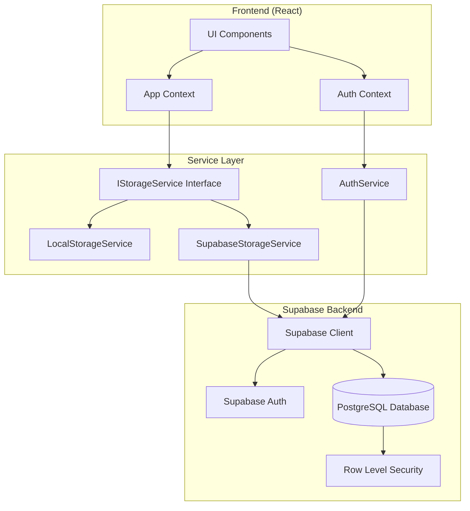

# Design Document: Supabase Cloud Storage Integration

## Overview

This design describes the integration of Supabase as a cloud backend for the LinkedIn Job Application Tracker. The implementation replaces localStorage-based persistence with a PostgreSQL database hosted on Supabase, enabling cross-device access, user authentication, and secure data storage.

The architecture follows a layered approach with an abstracted storage interface, allowing seamless switching between localStorage (for unauthenticated/offline use) and Supabase (for authenticated cloud storage).

## Architecture



## Components and Interfaces

### 1. Supabase Client Configuration

```typescript
// src/lib/supabase.ts
import { createClient } from '@supabase/supabase-js';
import type { Database } from '../types/supabase';

const supabaseUrl = import.meta.env.VITE_SUPABASE_URL;
const supabaseAnonKey = import.meta.env.VITE_SUPABASE_ANON_KEY;

export const supabase = createClient<Database>(supabaseUrl, supabaseAnonKey);
```

### 2. Authentication Service

```typescript
// src/services/AuthService.ts
export interface IAuthService {
  signUp(email: string, password: string): Promise<AuthResult>;
  signIn(email: string, password: string): Promise<AuthResult>;
  signOut(): Promise<void>;
  getSession(): Promise<Session | null>;
  onAuthStateChange(callback: (session: Session | null) => void): () => void;
}

export interface AuthResult {
  success: boolean;
  user?: User;
  error?: string;
}

export interface User {
  id: string;
  email: string;
}

export interface Session {
  user: User;
  accessToken: string;
}
```

### 3. Storage Service Interface (Extended)

```typescript
// src/services/StorageService.ts
export interface IStorageService {
  saveJob(job: Omit<JobPosting, 'id' | 'dateAdded' | 'lastUpdated'>): Promise<JobPosting>;
  getJob(id: string): Promise<JobPosting | null>;
  getAllJobs(): Promise<JobPosting[]>;
  updateJob(id: string, updates: Partial<JobPosting>): Promise<JobPosting | null>;
  deleteJob(id: string): Promise<boolean>;
  isAvailable(): boolean;
}
```

### 4. Supabase Storage Service

```typescript
// src/services/SupabaseStorageService.ts
export class SupabaseStorageService implements IStorageService {
  private supabase: SupabaseClient;
  private userId: string;

  constructor(supabase: SupabaseClient, userId: string);
  
  async saveJob(jobData: Omit<JobPosting, 'id' | 'dateAdded' | 'lastUpdated'>): Promise<JobPosting>;
  async getJob(id: string): Promise<JobPosting | null>;
  async getAllJobs(): Promise<JobPosting[]>;
  async updateJob(id: string, updates: Partial<JobPosting>): Promise<JobPosting | null>;
  async deleteJob(id: string): Promise<boolean>;
  isAvailable(): boolean;
}
```

### 5. Migration Service

```typescript
// src/services/MigrationService.ts
export interface IMigrationService {
  hasLocalData(): boolean;
  migrateToCloud(userId: string): Promise<MigrationResult>;
  clearLocalData(): void;
}

export interface MigrationResult {
  success: boolean;
  migratedCount: number;
  errors: string[];
}
```

### 6. Auth Context

```typescript
// src/context/AuthContext.tsx
export interface AuthContextValue {
  user: User | null;
  isLoading: boolean;
  isAuthenticated: boolean;
  signIn: (email: string, password: string) => Promise<AuthResult>;
  signUp: (email: string, password: string) => Promise<AuthResult>;
  signOut: () => Promise<void>;
}
```

## Data Models

### Database Schema (Supabase PostgreSQL)

```sql
-- Users table is managed by Supabase Auth

-- Job postings table
CREATE TABLE job_postings (
  id UUID PRIMARY KEY DEFAULT gen_random_uuid(),
  user_id UUID NOT NULL REFERENCES auth.users(id) ON DELETE CASCADE,
  job_id TEXT,
  job_title TEXT NOT NULL,
  company TEXT NOT NULL,
  location TEXT NOT NULL,
  description TEXT NOT NULL,
  linkedin_url TEXT,
  application_link TEXT,
  referral_message TEXT NOT NULL DEFAULT '',
  referral_outreach_status TEXT NOT NULL DEFAULT 'Have to Find',
  notes TEXT NOT NULL DEFAULT '',
  status TEXT NOT NULL DEFAULT 'Saved',
  referral_contacts JSONB NOT NULL DEFAULT '[]',
  date_added TIMESTAMPTZ NOT NULL DEFAULT NOW(),
  date_applied TIMESTAMPTZ,
  last_updated TIMESTAMPTZ NOT NULL DEFAULT NOW(),
  
  CONSTRAINT valid_status CHECK (status IN ('Saved', 'Applied', 'Interview', 'Offer', 'Rejected')),
  CONSTRAINT valid_referral_status CHECK (referral_outreach_status IN ('Have to Find', 'Found Contact', 'Messaged', 'Got Referral', 'No Response', 'Declined'))
);

-- Row Level Security
ALTER TABLE job_postings ENABLE ROW LEVEL SECURITY;

-- Policy: Users can only see their own jobs
CREATE POLICY "Users can view own jobs" ON job_postings
  FOR SELECT USING (auth.uid() = user_id);

-- Policy: Users can only insert their own jobs
CREATE POLICY "Users can insert own jobs" ON job_postings
  FOR INSERT WITH CHECK (auth.uid() = user_id);

-- Policy: Users can only update their own jobs
CREATE POLICY "Users can update own jobs" ON job_postings
  FOR UPDATE USING (auth.uid() = user_id);

-- Policy: Users can only delete their own jobs
CREATE POLICY "Users can delete own jobs" ON job_postings
  FOR DELETE USING (auth.uid() = user_id);

-- Index for faster user queries
CREATE INDEX idx_job_postings_user_id ON job_postings(user_id);
CREATE INDEX idx_job_postings_date_added ON job_postings(date_added DESC);
```

### TypeScript Database Types

```typescript
// src/types/supabase.ts
export interface Database {
  public: {
    Tables: {
      job_postings: {
        Row: {
          id: string;
          user_id: string;
          job_id: string | null;
          job_title: string;
          company: string;
          location: string;
          description: string;
          linkedin_url: string | null;
          application_link: string | null;
          referral_message: string;
          referral_outreach_status: string;
          notes: string;
          status: string;
          referral_contacts: ReferralContact[];
          date_added: string;
          date_applied: string | null;
          last_updated: string;
        };
        Insert: Omit<Database['public']['Tables']['job_postings']['Row'], 'id' | 'date_added' | 'last_updated'>;
        Update: Partial<Database['public']['Tables']['job_postings']['Insert']>;
      };
    };
  };
}
```

### Data Transformation Functions

```typescript
// src/utils/jobTransformers.ts

// Convert database row to JobPosting
export function dbRowToJobPosting(row: DbJobPostingRow): JobPosting;

// Convert JobPosting to database insert format
export function jobPostingToDbInsert(job: Omit<JobPosting, 'id' | 'dateAdded' | 'lastUpdated'>, userId: string): DbJobPostingInsert;

// Convert JobPosting updates to database update format
export function jobUpdatesToDbUpdate(updates: Partial<JobPosting>): DbJobPostingUpdate;
```

## Correctness Properties

*A property is a characteristic or behavior that should hold true across all valid executions of a system-essentially, a formal statement about what the system should do. Properties serve as the bridge between human-readable specifications and machine-verifiable correctness guarantees.*

Based on the prework analysis, the following correctness properties have been identified:

### Property 1: Job Posting Round-Trip Consistency

*For any* valid JobPosting object, serializing it to database format and then deserializing it back SHALL produce an equivalent JobPosting with all original field values preserved.

**Validates: Requirements 2.5, 2.6**

### Property 2: Save-Retrieve Consistency

*For any* job posting saved by an authenticated user, retrieving all jobs for that user SHALL include the saved job with matching field values.

**Validates: Requirements 2.1, 2.2**

### Property 3: Update Persistence

*For any* existing job posting and valid partial update, after applying the update, retrieving the job SHALL return the updated values while preserving unchanged fields.

**Validates: Requirements 2.3**

### Property 4: Delete Removes Job

*For any* job posting that is deleted, subsequent retrieval attempts for that job SHALL return null, and the job SHALL NOT appear in the user's job list.

**Validates: Requirements 2.4**

### Property 5: User Isolation

*For any* query executed by an authenticated user, all returned job postings SHALL have a user_id matching the authenticated user's ID.

**Validates: Requirements 3.1**

### Property 6: Migration Completeness

*For any* set of job postings in localStorage, after successful migration, all jobs SHALL exist in the cloud database with equivalent field values.

**Validates: Requirements 5.2**

### Property 7: Storage Interface Contract

*For any* storage operation (save, get, getAll, update, delete), both LocalStorageService and SupabaseStorageService implementations SHALL accept the same input types and return the same output types.

**Validates: Requirements 6.2**

## Error Handling

### Authentication Errors

| Error Type | User Message | Recovery Action |
|------------|--------------|-----------------|
| Invalid credentials | "Invalid email or password. Please try again." | Clear password field, focus on password input |
| Email not verified | "Please verify your email before signing in." | Show resend verification option |
| Network error | "Unable to connect. Please check your internet connection." | Show retry button |
| Rate limited | "Too many attempts. Please try again in a few minutes." | Disable form temporarily |

### Storage Errors

| Error Type | User Message | Recovery Action |
|------------|--------------|-----------------|
| Network failure | "Unable to save changes. Please check your connection." | Queue operation for retry, show retry button |
| Unauthorized | "Session expired. Please sign in again." | Redirect to sign-in |
| Conflict | "This job was modified elsewhere. Please refresh." | Offer to reload data |
| Unknown | "Something went wrong. Please try again." | Log error, show retry option |

### Migration Errors

| Error Type | User Message | Recovery Action |
|------------|--------------|-----------------|
| Partial failure | "Some jobs could not be migrated. {count} jobs remain in local storage." | Show which jobs failed, offer retry |
| Complete failure | "Migration failed. Your local data is preserved." | Keep localStorage intact, offer retry |

## Testing Strategy

### Property-Based Testing Library

This project will use **fast-check** for property-based testing, which is already installed in the project.

### Property-Based Tests

Each correctness property will be implemented as a property-based test with a minimum of 100 iterations:

1. **Round-Trip Test**: Generate arbitrary JobPosting objects, serialize to DB format, deserialize back, verify equality
2. **Save-Retrieve Test**: Generate arbitrary jobs, save them, retrieve all, verify saved job is present
3. **Update Test**: Generate job and partial updates, apply update, verify changes persisted
4. **Delete Test**: Generate and save job, delete it, verify it's no longer retrievable
5. **User Isolation Test**: Generate jobs for multiple users, query as one user, verify only their jobs returned
6. **Migration Test**: Generate localStorage jobs, migrate, verify all exist in cloud
7. **Interface Contract Test**: Generate operations, execute on both implementations, verify same behavior

### Unit Tests

Unit tests will cover:
- Authentication flow (sign up, sign in, sign out)
- Error handling for network failures
- UI state transitions (loading, error, success states)
- Migration prompt logic

### Test Annotations

All property-based tests must include the annotation:
```typescript
// **Feature: supabase-cloud-storage, Property {number}: {property_text}**
```
